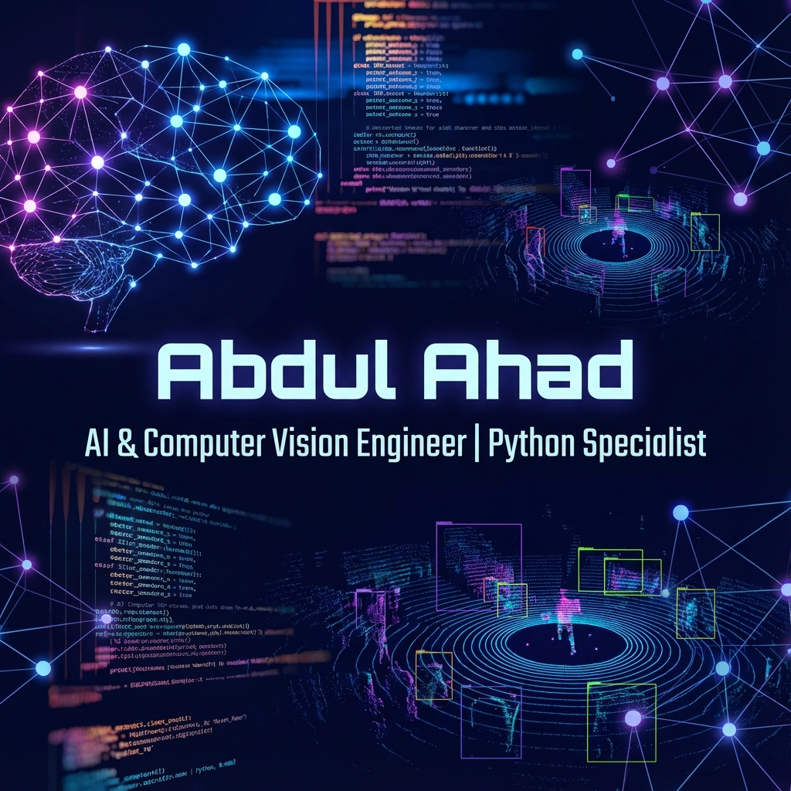

  
  
   

  <h1>Hi there, I'm <a href="https://linkedin.com/in/abdulahad-israr-066149399/">Abdul Ahad</a>! 👋</h1>
  
  <h3>🚀 AI & Computer Vision Engineer | Python Specialist</h3>
  
  

    
    
    
  

  

    <i>Building intelligent systems that "see," "reason," and "solve."</i>
  

 

### 👨‍💻 About Me
I am a BSCS student at **SZABIST** with a deep-rooted passion for **Computer Vision** and **Autonomous Agents**. My objective is to bridge the gap between complex AI research and practical, real-world applications. I thrive on building robust systems that leverage the power of LLMs and digital vision to automate the future.

---

### 🛠️ Core Expertise

  

 

- **Computer Vision:** YOLOv8, Mediapipe, OCR, Object Detection, Gender Classification.
- **Autonomous Agents:** LangChain, LangGraph, Multi-Agent Orchestration, Groq LLM integration.
- **Python Development:** Data Analytics, API Development, Scripting, Automation.

---

### 🌟 Featured Projects

<table align="center">
  <tr>
    <td width="50%" valign="top">
      <h4>🤖 <a href="https://github.com/AbdulAhad5138/MultiAgent-Data-Explorer">DataForge AI Dashboard</a></h4>
      
A premium multi-agent analytics system that autonomously explores CSV data, generates visual strategies, and provides deep insights.

      <code>LangGraph</code> <code>Streamlit</code> <code>Groq LLM</code>
    </td>
    <td width="50%" valign="top">
      <h4>👁️ <a href="https://github.com/AbdulAhad5138/Face_Detection">Vision Guard</a></h4>
      
Advanced real-time face detection and gender classification system using YOLOv8-cls and OpenCV, trained on custom diverse datasets.

      <code>YOLOv8</code> <code>OpenCV</code> <code>Python</code>
    </td>
  </tr>
  <tr>
    <td width="50%" valign="top">
      <h4>🚗 <a href="https://github.com/AbdulAhad5138/num_plate_detection">ALPR System</a></h4>
      
Automated License Plate Recognition system leveraging Computer Vision and OCR for efficient vehicle identification.

      <code>OpenCV</code> <code>OCR</code> <code>Python</code>
    </td>
    <td width="50%" valign="top">
      <h4>🛡️ <a href="https://github.com/AbdulAhad5138/fake-news-detector">Fake News Shield</a></h4>
      
AI-powered detector to combat misinformation by analyzing textual patterns and credibility.

      <code>NLP</code> <code>Scikit-learn</code> <code>Python</code>
    </td>
  </tr>
</table>

---

### 📊 Digital Footprint

  
  

---

### 📫 Let's Collaborate
Whether it's an exciting AI project, a research opportunity, or just a coffee chat about the future of tech—I'm always open to connecting!

  
  
  

  

